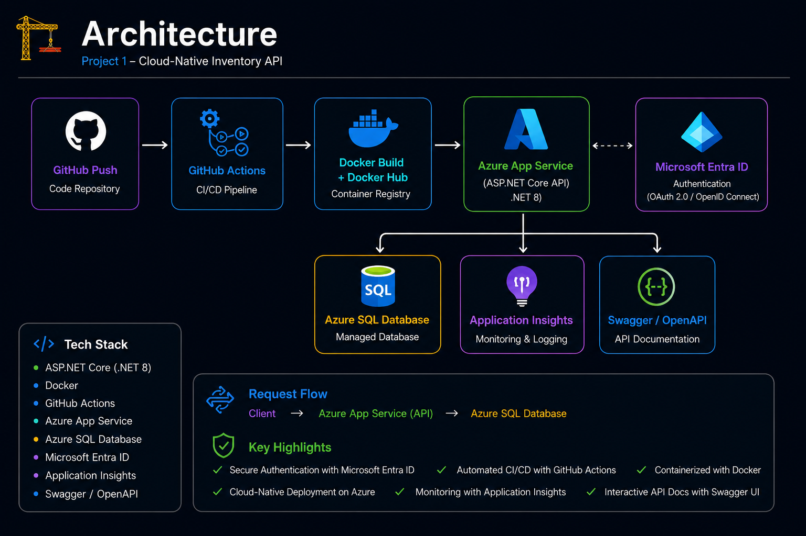

# StockFlow API 🚀

Production-style cloud-native Inventory Management REST API built with ASP.NET Core 8, Microsoft Entra ID, Docker, GitHub Actions CI/CD, Azure App Service, and Azure SQL.


## 🌐 Live Demo

🔗 Swagger UI  <https://stockflow-api-prod.azurewebsites.net/swagger>

Authenticate using your Microsoft account to test the secured API endpoints.

Public endpoint:
/health

Protected endpoints:
/api/products
           

## 💻 Tech Stack

|Layer           |Technology                          |
|----------------|------------------------------------|
|API             |ASP.NET Core 8                      |
|Auth            |Microsoft Entra ID (OAuth2)         |
|Database        |SQL Server on Azure                 |
|ORM             |Entity Framework Core               |
|Containerization|Docker                              |
|Registry        |Docker Hub                          |
|CI/CD           |GitHub Actions                      |
|Hosting         |Azure App Service                   |
|Logging         |Serilog                             |
|Monitoring      |Azure Application Insights          |
|Documentation   |Swagger / OpenAPI                   |

## 🏗️ Architecture



```
GitHub Push

↓
GitHub Actions CI/CD

↓
Docker Build & Push → Docker Hub

↓
Azure App Service (Docker Container)

↓
Azure SQL Database
```

## 🌐 API Endpoints

|Method|Endpoint          |Description      |Auth       |
|------|------------------|-----------------|---------- |
|GET   |/health           |Health check     |Public     |
|GET   |/api/Products     |Get all products |🔒 Required|
|POST  |/api/Products     |Create product   |🔒 Required|
|GET   |/api/Products/{id}|Get product by ID|🔒 Required|
|PUT   |/api/Products/{id}|Update product   |🔒 Required|
|DELETE|/api/Products/{id}|Delete product   |🔒 Required|

## ✅ Features

✔ Secure REST API

✔ Microsoft Entra ID Authentication

✔ JWT Bearer Authorization

✔ Entity Framework Core

✔ SQL Server

✔ Docker Containerization

✔ GitHub Actions CI/CD

✔ Azure App Service Deployment

✔ Azure Application Insights

✔ Health Checks

✔ Swagger/OpenAPI

✔ Kubernetes Ready

## 🚀 CI/CD Pipeline

Every push to `main` automatically:

1. Restores and builds the .NET project
1. Builds a Docker image
1. Pushes to Docker Hub
1. Deploys to Azure App Service

## 🖥️ Local Development

### Prerequisites

- .NET 8 SDK
- Docker Desktop
- SQL Server or Docker

### Run locally
,,Bash

git clone https://github.com/usmanb21/Stockflow-API.git

cd Stockflow-API

docker compose up -d

dotnet restore
dotnet build
dotnet run

### Run with Docker

```bash
docker-compose up -d
```

## 🏗️ Technical Decisions

|Decision        |Choice                  |Why                                             |
|----------------|---------------------   |------------------------------------------------|
|Auth            |Microsoft Entra ID OAuth2 |Enterprise standard; avoids managing credentials|
|Database        |SQL Server on Azure      |ACID compliance for inventory data integrity   |
|ORM             |Entity Framework Core    |Type-safe migrations, avoids raw SQL errors    |
|Logging         |Serilog                  |Structured logs compatible with Azure Monitor  |
|Containerization|Docker                   |Consistent environments across dev and prod    |
|CI/CD           |GitHub Actions           |Native GitHub integration, no extra tooling    |
|DB in K8s       |Pod (demo only)         |Production should use Azure SQL Managed Instance|

## 👤 Author

**@Usman**
[LinkedIn](https://www.linkedin.com/in/usman-zahid-butt-353a9430)
